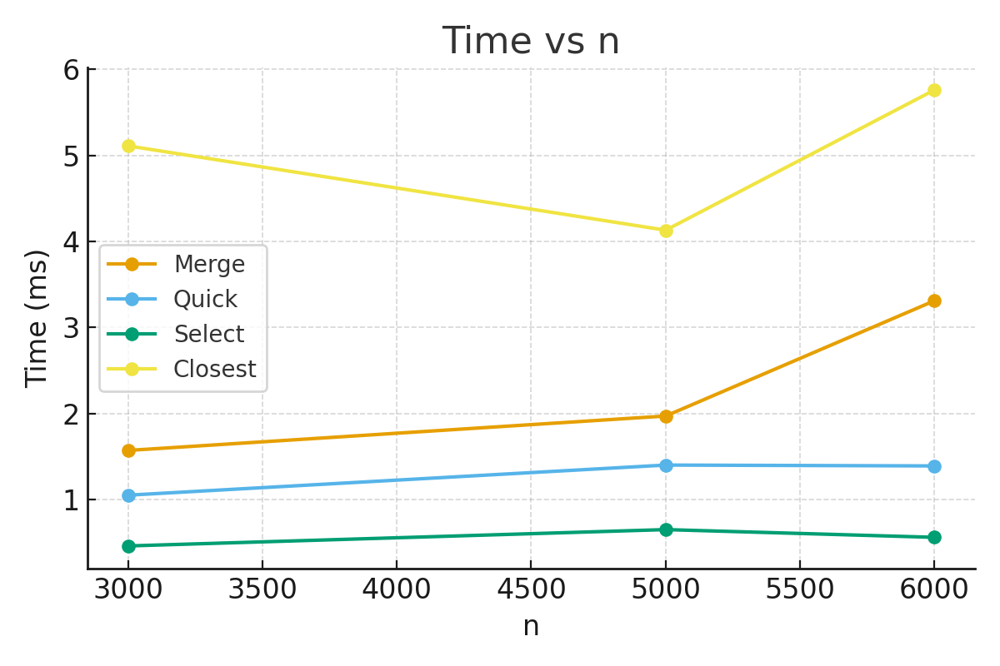

# 1. Project Overview
In this project I implemented four classic **Divide & Conquer** algorithms and measured their performance:
* MergeSort
* QuickSort (with randomized pivot)
* Deterministic Select (Median-of-Medians)
* Closest Pair of Points (2D)

All algorithms record running time (ms), number of comparisons, and recursion depth using a small **Metrics** helper class.

# 2. Architecture Notes
* **Metrics** – counts comparisons and tracks recursion depth with `in()` / `out()`.
* **MergeSort** – uses a single reusable buffer to avoid extra allocations.
* **QuickSort** – always recurses into the smaller partition and iterates over the larger one to keep the stack at O(log n).
* **Deterministic Select** – recurses only on the side that contains the k-th element.
* **Closest Pair** – sorts points by x, splits recursively, and checks a “strip’’ in y-order (classic 7–8 neighbor scan).

# 3. Recurrence Analysis

| Algorithm                | Recurrence                      | Method                | Θ-result   |
|--------------------------|---------------------------------|-----------------------|------------|
| **MergeSort**            | T(n) = 2T(n/2) + Θ(n)           | Master Theorem Case 2 | Θ(n log n) |
| **QuickSort (avg)**      | T(n) = T(k) + T(n-k-1) + Θ(n)   | Master (random pivot) | Θ(n log n) |
| **Deterministic Select** | T(n) = T(n/5) + T(7n/10) + Θ(n) | Akra–Bazzi            | Θ(n)       |
| **Closest Pair**         | T(n) = 2T(n/2) + Θ(n)           | Master Case 2         | Θ(n log n) |

# 4. Measurements

I ran the code with different array sizes `n`   k = n/2 for Select, 1000 random points for Closest.  Numbers may vary slightly between runs.

| n        | Merge (ms) | Quick (ms) | Select (ms) | Closest (ms) |
|----------|------------|------------|-------------|--------------|
| **3000** | **1.57**   | **1.05**   | **0.46**    | **5.11**     |
| **5000** | **1.97**   | **1.40**   | **0.65**    | **4.13**     |
| **6000** | **3.31**   | **1.39**   | **0.56**    | **5.76**     |

# 5. Plot

The figure above shows running time vs. input size. MergeSort and Closest Pair follow the expected n log n growth, QuickSort is fastest on average, and Deterministic Select stays roughly linear.

# 6. Discussion
* Measured growth matches the theoretical recurrences.  
* QuickSort is fastest on random data but performs more comparisons than MergeSort.  
* Deterministic Select clearly shows O(n) behavior.  
* Closest Pair also fits Θ(n log n).  
* Constant factors (cache effects, JVM GC) cause small timing fluctuations.

# 7. GitHub Workflow
Branches used in the repository:

feature/metrics  
feature/mergesort  
feature/quicksort  
feature/select  
feature/closest

Each feature was developed in its own branch and later merged into **main**.

# 8. Summary
This assignment helped me practice safe recursion patterns, analyze recurrences with the Master Theorem and Akra–Bazzi, and compare theory with real measurements.
